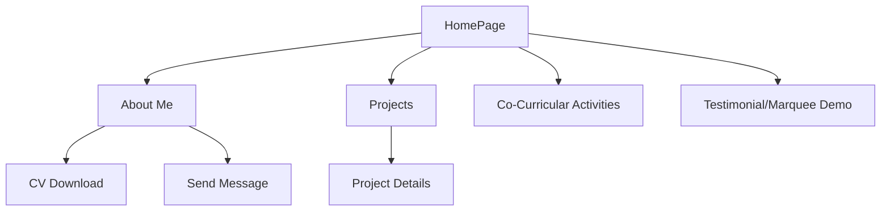

# Towfiq's Dev Portfolio
A modern, interactive developer portfolio built with **React**, **Vite**, and **Tailwind CSS**. This project showcases my journey, projects, and creative UI concepts, including interactive 3D models, with a focus on performance, accessibility, and responsive design.

## 🚀 Overview

**Portfolio React** is a fast, responsive, and visually engaging developer portfolio. It highlights my skills, selected projects, and creative UI solutions, all powered by a modern web stack.

## 📸 Preview

| Home Page | About Me |
|-----------|----------|
|  |  |

| Co-Curricular Activities | Selected Projects |
|-------------------------|-------------------|
|  |  |

| Mobile View |
|-------------|
|  |

## ✨ Features

| Feature | Description |
| :-- | :-- |
| Modern React + Vite | Lightning-fast performance and hot reloading |
| Tailwind CSS | Utility-first, responsive, and beautiful UI |
| 3D Model Integration | Interactive, engaging user experiences |
| Project Showcase | Detailed descriptions and tech stack highlights |
| Mobile-First Design | Seamless experience on any device |
| Downloadable CV | Easy access to my resume |
| Easy Contact Options | Quick ways to get in touch |
| Deployed on Vercel | Global speed and reliability |

## 🎬 Workflow –





## 📦 Getting Started

### Prerequisites

- [Node.js](https://nodejs.org/) (v20+ recommended)
- [npm](https://www.npmjs.com/) or [yarn](https://yarnpkg.com/)


### Installation

```bash
git clone https://github.com/Tomalsan/Portfolio-REACT-.git
cd Portfolio-REACT-
npm install
```


### Development

```bash
npm run dev
```

Visit [http://localhost:5173](http://localhost:5173) in your browser.

## 🏗️ Project Structure

| Folder / File | Description |
| :-- | :-- |
| `/src` | Main source code |
| `/src/components` | Reusable React components |
| `/src/assets` | Images and static assets |
| `/src/pages` | Main page components |
| `/public` | Static files served directly |
| `vite.config.js` | Vite configuration |
| `tailwind.config.js` | Tailwind CSS configuration |

## ⚙️ Scripts

| Command | Description |
| :-- | :-- |
| `npm run dev` | Start development server |
| `npm run build` | Build for production |
| `npm run preview` | Preview production build |
| `npm run lint` | Lint codebase (if configured) |

## 🌐 Deployment

This project is ready for deployment on platforms like **Vercel**, **Netlify**, or any static site host.

**To deploy on Vercel:**

1. Push your code to GitHub.
2. Import the repository into [Vercel](https://vercel.com/).
3. Set up build command: `npm run build`
4. Set output directory: `dist`

## 📚 What I Learned

- Deepened my knowledge of **React** and **JavaScript**
- Mastered **Tailwind CSS** for utility-first UI development
- Explored **3D graphics and animation** in the browser
- Built reusable, accessible, and modern components


## 🤝 Connect with Me

- [LinkedIn](https://www.linkedin.com/in/towfiq-ul-iqbal-tomal-11a875246/)
- [Portfolio Live](https://portfolio-react-iota-eight.vercel.app/)

> “Building secure, creative, and robust web applications — one project at a time.”

## 🙌 Contributing

Feel free to **fork**, **star**, or reach out if you want to collaborate!
Pull requests are welcome.

## 📄 License

This project is licensed under the MIT License.


**Thank you for checking out my portfolio!**

<div style="text-align: center">⁂</div>

[^1]: https://r2cdn.perplexity.ai/pplx-full-logo-primary-dark@2x.png

